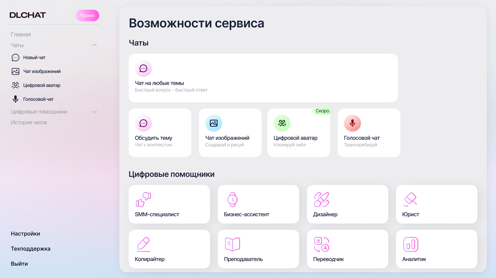
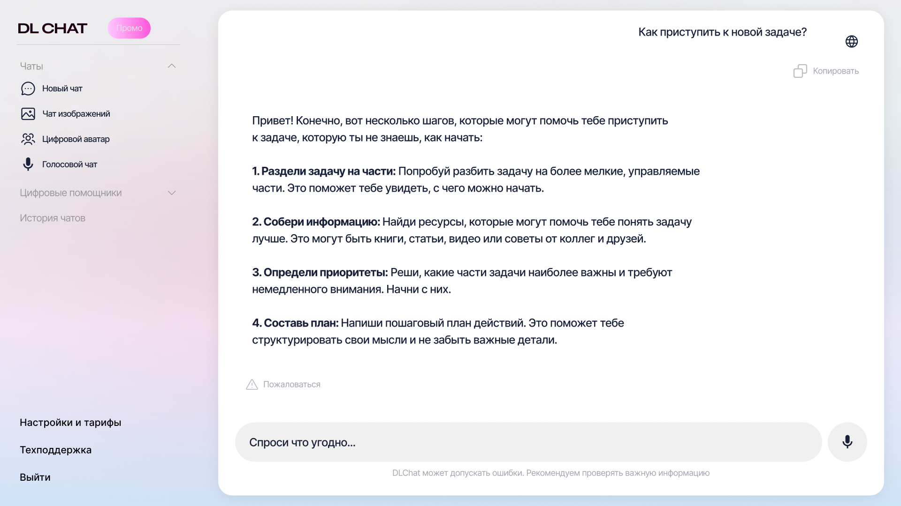
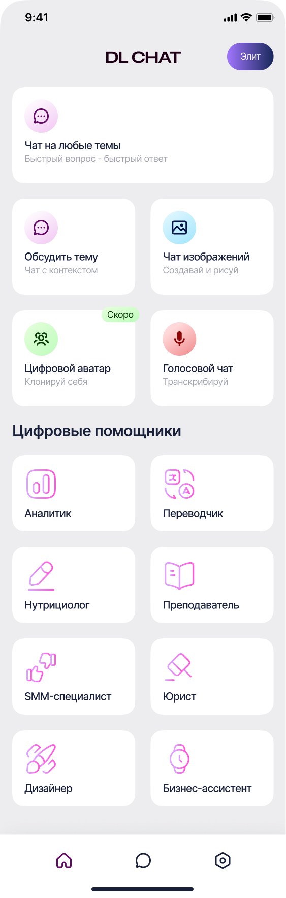
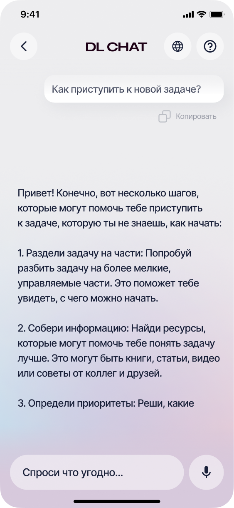

# DLChat

Персональный ИИ-ассистент для общения, работы с текстами, создания изображений
и расшифровки записей. Адаптивное приложение для Android, iOS, macOS и Web.

## Возможности

- **Чаты с ИИ** — общение с контекстом, история диалогов и поиск в интернете.
- **Генерация изображений** — создание картинок по текстовому описанию и сохранение результата.
- **Работа с документами** — прикрепление PDF, текстовых файлов, документов и таблиц к сообщениям.
- **Голос и транскрибация** — голосовые сообщения, расшифровка аудио и видео.
- **Цифровые помощники** — специализированные ассистенты для работы, учёбы и повседневных задач.
- **Адаптивный интерфейс** — удобная работа на телефоне и большом экране.

## Скриншоты

### На большом экране

**Главная — чаты и цифровые помощники**

**Чат с ИИ-ассистентом**

### На телефоне

<table>
  <tr>
    <th align="center">Главная</th>
    <th align="center">Чат</th>
  </tr>
  <tr>
    <td align="center" valign="top">
      
    </td>
    <td align="center" valign="top">
      
    </td>
  </tr>
</table>
